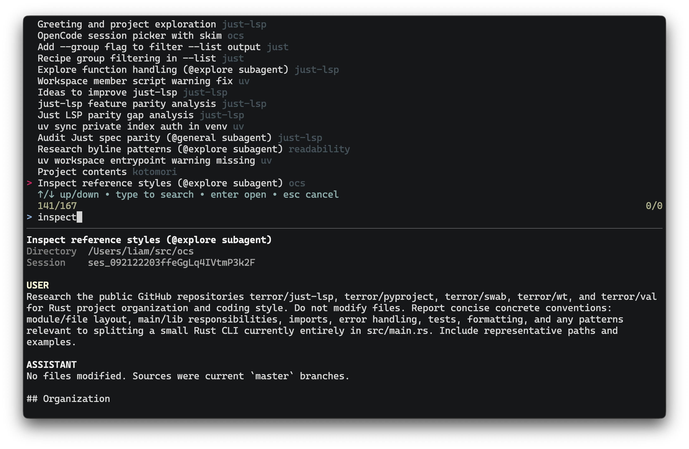

## ocs

[](https://github.com/terror/ocs/releases/latest)
[](https://github.com/terror/ocs/actions/workflows/ci.yaml)
[](https://codecov.io/gh/terror/ocs)
[](https://github.com/terror/ocs/releases)

`ocs` is a better session picker for [opencode](https://opencode.ai/).



`ocs` indexes your local OpenCode sessions and presents them in a full-screen
fuzzy finder. Search by title, project directory, session ID, or text from the
four most recent user prompts. The selected session is reopened with
`opencode --session` in its original directory when that directory still
exists.

The preview shows the session title, directory, ID, and complete text-message
transcript. Session data is read directly from OpenCode's SQLite database;
`ocs` does not modify it.

## Installation

`ocs` should run on any system, including Linux, MacOS, and Windows.

The easiest way to install it is by using
[cargo](https://doc.rust-lang.org/cargo/), the Rust package manager:

```bash
cargo install ocs
```

Otherwise, see below for the complete package list:

#### Cross-platform

<table>
  <thead>
    <tr>
      <th>Package Manager</th>
      <th>Package</th>
      <th>Command</th>
    </tr>
  </thead>
  <tbody>
    <tr>
      <td><a href=https://www.rust-lang.org>Cargo</a></td>
      <td><a href=https://crates.io/crates/ocs>ocs</a></td>
      <td><code>cargo install ocs</code></td>
    </tr>
    <tr>
      <td><a href=https://brew.sh>Homebrew</a></td>
      <td><a href=https://github.com/terror/homebrew-tap>terror/tap/ocs</a></td>
      <td><code>brew install terror/tap/ocs</code></td>
    </tr>
  </tbody>
</table>

## Usage

Run `ocs` without arguments to browse sessions. Type to fuzzy-search, use the
arrow keys to move through matches, and press enter to open the selected
session. Press escape or control-c to cancel.

```bash
ocs
```

Pass an initial query with `--query`:

```bash
ocs --query picker
```

Use `--print` to write the selected session ID to standard output instead of
opening OpenCode. This is useful for scripts and shell integrations:

```bash
ocs --print
```

## Data Directory

By default, `ocs` reads `opencode.db` from `$XDG_DATA_HOME/opencode`. When
`XDG_DATA_HOME` is unset, it falls back to `$HOME/.local/share/opencode`.

Pass `--data-dir` to use an alternate OpenCode data directory, such as a
separate profile or a copied database:

```bash
ocs --data-dir /path/to/opencode
```

## Prior Art

This project was inspired by the session picker built into
[opencode](https://opencode.ai/). `ocs` makes old sessions easier to find by
searching their metadata and recent prompts, with a full transcript preview.
