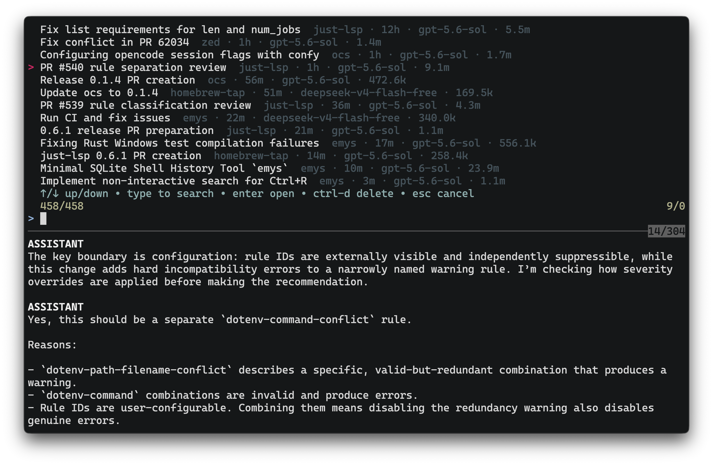

## ocs

[](https://github.com/terror/ocs/releases/latest)
[](https://github.com/terror/ocs/actions/workflows/ci.yaml)
[](https://codecov.io/gh/terror/ocs)
[](https://github.com/terror/ocs/releases)

`ocs` is a better session picker for [opencode](https://opencode.ai/).



`ocs` indexes your local OpenCode sessions and presents them in a full-screen
fuzzy finder. Search by title, project directory, session ID, or text from the
four most recent user prompts. The selected session is reopened with
`opencode --session` in its original directory when that directory still
exists.

Each row shows when the session was updated, its model, cost, and total token
usage.

By default, `ocs` shows only sessions started in the current directory.

The preview shows the session title, directory, ID, and complete text-message
transcript. Press control-d to delete the selected session and its messages.

## Installation

`ocs` should run on any system, including Linux, MacOS, and Windows.

The easiest way to install it is by using
[cargo](https://doc.rust-lang.org/cargo/), the Rust package manager:

```bash
cargo install ocs
```

Otherwise, see below for the complete package list:

#### Cross-platform

<table>
  <thead>
    <tr>
      <th>Package Manager</th>
      <th>Package</th>
      <th>Command</th>
    </tr>
  </thead>
  <tbody>
    <tr>
      <td><a href=https://www.rust-lang.org>Cargo</a></td>
      <td><a href=https://crates.io/crates/ocs>ocs</a></td>
      <td><code>cargo install ocs</code></td>
    </tr>
    <tr>
      <td><a href=https://brew.sh>Homebrew</a></td>
      <td><a href=https://github.com/terror/homebrew-tap>terror/tap/ocs</a></td>
      <td><code>brew install terror/tap/ocs</code></td>
    </tr>
  </tbody>
</table>

### Pre-built binaries

Pre-built binaries for Linux, MacOS, and Windows can be found on
[the releases page](https://github.com/terror/ocs/releases).

## Usage

Run `ocs` without arguments to browse sessions. Type to fuzzy-search, use the
arrow keys to move through matches, press enter to open the selected session,
or press control-d to delete it. Press escape or control-c to cancel.

```bash
ocs
```

Pass an initial query with `--query`:

```bash
ocs --query picker
```

Use `--all` to show sessions from every directory:

```bash
ocs --all
```

Use `--print` to write the selected session ID to standard output instead of
opening OpenCode. This is useful for scripts and shell integrations:

```bash
ocs --print
```

### Shell Integration

Add the appropriate command to your shell configuration to bind `control-x`
followed by `s` to session history search.

Bash (`.bashrc`):

```bash
eval "$(ocs init bash)"
```

Zsh (`.zshrc`):

```zsh
eval "$(ocs init zsh)"
```

The current command line is used as the initial search query. Selecting a
session clears the command line and opens the session immediately. The
integration also defines an `ocs` function that passes the selected session ID
to OpenCode. Arguments are forwarded to the `ocs` binary, so commands such as
`ocs --query picker` continue to work.

## Configuration

On first run, `ocs` creates `config.toml` in the platform configuration
directory selected by `confy`. On Linux and macOS this is normally
`$XDG_CONFIG_HOME/ocs/config.toml`, or `~/.config/ocs/config.toml` when
`XDG_CONFIG_HOME` is unset.

Set `opencode_args` to pass additional arguments whenever a session is opened:

```toml
opencode_args = ["--auto"]
```

Each array entry is passed to OpenCode as one argument. These arguments do not
affect database discovery or session deletion commands.

## Database

By default, `ocs` uses `OPENCODE_DB` when set. Otherwise, it prefers
`opencode-next.db` and falls back to `opencode.db` in
`$XDG_DATA_HOME/opencode`, or `$HOME/.local/share/opencode` when
`XDG_DATA_HOME` is unset.

Pass `--database` to use a specific OpenCode database file, such as a
separate profile or a copied database:

```bash
ocs --database /path/to/opencode-next.db
```

Pass `--data-dir` to use an alternate OpenCode data directory, as before:

```bash
ocs --data-dir /path/to/opencode
```

## Prior Art

This project was inspired by the session picker built into
[opencode](https://opencode.ai/). `ocs` makes old sessions easier to find by
searching their metadata and recent prompts, with a full transcript preview.
